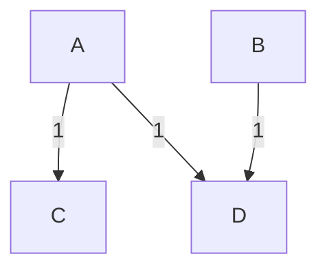
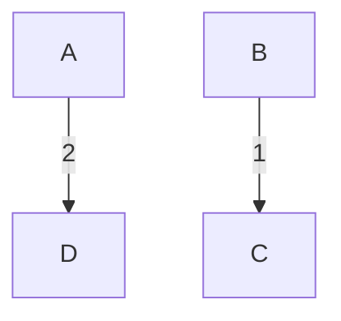

# Payback

If you have a network of people, which own each other money, paying off debts can lead to many transactions. With this crate the amount of transactions can be minimized.

# How it works
We represent the network as a graph. Each node represents one person and every person has an amount of money the need to pay/receive represented as a vertex weight. Negative weights indicate a net dept to the network while positive weights indicate a dept on the side of the network to the person.
The aim is to find directed weighted edges, which indicate cash flow, such that for every person there inflow minus there outflow is equal to their vertex weight (how much money they own/get from the network). Also, the amount of edges should be minimal.

# Usage in Crates

## Generating Graphs
A graph can be generated in two different manners.

### Via Weighted Directed Edges
In this method we describe the edges between the nodes. Each edge has a start and end node with a weight. Every vertex needs a unique name. Otherwise, the two vertices will be interpreted as the same.
We show how to create the following graph.

The graph from this representation will just be converted to a graph from [Via Vertex Weights](#via-vertex-weights).

#### From Vec<((String, String), i64)>
```rust
let input: Vec<((String, String), i64)> = vec![
    (("A".to_string(), "C".to_string()), 1),
    (("A".to_string(), "D".to_string()), 1),
    (("B".to_string(), "D".to_string()), 1),
];
let graph: Graph = input.into();
```
Here the nodes are named `A`, `B`, `C`, `D`.

#### From HashMap<(String, String), i64>
```rust
let mut input: HashMap<(String, String), i64> = HashMap::new();
input.insert(("A".to_string(), "C".to_string()), 1);
input.insert(("A".to_string(), "D".to_string()), 1);
input.insert(("B".to_string(), "D".to_string()), 1);
let graph: Graph = input.into();
```
Here the nodes are named `A`, `B`, `C`, `D`.

### Via Vertex Weights
For this method, we will tell the graph the nodes and there weight directly. Here are some options for this option. The weights represent how much a person has to pay/receive.
We show how to create the following nodes and their weights.
| Vertex | A | B | C | D |
| --- | --- | --- | ---| ---|
| Weight | -2 | -1 | 1 | 2 |

#### From Vec\<i64\>
```rust
let input: Vec<i64> = vec![-2, -1, 1, 2];
let graph: Graph = input.into();
```
Here the nodes names are just numbers from `0` to `n`. Therefore, `0`, `1`, `2`, `3`.

#### From Vec<(String, i64)>
```rust
let input: Vec<(String, i64)> = vec![
    ("A".to_string(), -2),
    ("B".to_string(), -1),
    ("C".to_string(), 1),
    ("D".to_string(), 2),
];
let graph: Graph = input.into();
```
Here the nodes are named `A`, `B`, `C`, `D`.

#### From HashMap<String, i64>
```rust
let mut input: HashMap<String, i64> = HashMap::new();
input.insert("A".to_string(), -2);
input.insert("B".to_string(), -1);
input.insert("C".to_string(), 1);
input.insert("D".to_string(), 2);
let graph: Graph = input.into();
```
Here the nodes are named `A`, `B`, `C`, `D`.

## Solving
Available solver:
| Solver | Type | Description |
| --- | --- | --- |
| Star Expand | 2 Approximation | Approximates optimal solution by choosing central node, to which all edges are incident. |
| Greedy Satisfaction | 2 Approximation | Approximates optimal solution while minimizing the total weight of all edges. |
| Partitioning with Star Expand | Exact | Partitioning based exact solver, which solves base cases with Star Expand. |
| Partitioning with Greedy Satisfaction | Exact | Partitioning based exact solver, which solves base cases with Greedy Satisfaction. |

Approximation algorithm don't necessarily return the optimal solution but theirs is not worse than a given factor. Also, they run in polynomial time.

Exact algorithm give the optimal solution, but its runtime is not polynomial. This can lead to long runtimes while working with larger inputs. Generally it is uncommon to have an instance, for which an approximation algorithm does not return the optimal answer.

### Using Star Expand
Solve the instance and print the transactions.
```rust
let instance = ProblemInstance::from(graph);
let sol = <dyn SolverApproximation::<StarExpand> as Solver>::solve(&instance);
instance.print_solution(&sol);
```
Solve the instance and print a [dot](https://graphviz.org/docs/layouts/dot/) string for graph visualization with [graphviz](https://graphviz.org).
```rust
use payback::SolvingMethods::ApproxStarExpand;

let instance = ProblemInstance::from(graph);
let sol = instance.solve_with(ApproxStarExpand);
instance.solution_to_dot_string(&sol);
```

### Using Greedy Satisfaction 
Solve the instance and print the transactions.
```rust
let instance = ProblemInstance::from(graph);
let sol = <dyn SolverApproximation::<GreedySatisfaction> as Solver>::solve(&instance);
instance.print_solution(&sol);
```
Solve the instance and print a [dot](https://graphviz.org/docs/layouts/dot/) string for graph visualization with [graphviz](https://graphviz.org).
```rust
use payback::SolvingMethods::ApproxGreedySatisfaction;

let instance = ProblemInstance::from(graph);
let sol = instance.solve_with(ApproxGreedySatisfaction);
instance.solution_to_dot_string(&sol);
```

### Using Partitioning with Star Expand
Solve the instance and print the transactions.
```rust
let instance = ProblemInstance::from(graph);
let sol = <dyn SolverPartitioning::<StarExpand> as Solver>::solve(&instance);
instance.print_solution(&sol);
```
Solve the instance and print a [dot](https://graphviz.org/docs/layouts/dot/) string for graph visualization with [graphviz](https://graphviz.org).
```rust
use payback::SolvingMethods::PartitioningStarExpand;

let instance = ProblemInstance::from(graph);
let sol = instance.solve_with(PartitioningsStarExpand);
instance.solution_to_dot_string(&sol);
```

### Using Partitioning with Greedy Satisfaction
Solve the instance and print the transactions.
```rust
let instance = ProblemInstance::from(graph);
let sol = <dyn SolverPartitioning::<GreedySatisfaction> as Solver>::solve(&instance);
instance.print_solution(&sol);
```
Solve the instance and print a [dot](https://graphviz.org/docs/layouts/dot/) string for graph visualization with [graphviz](https://graphviz.org).
```rust
use payback::SolvingMethods::PartitioningsGreedySatisfaction;

let instance = ProblemInstance::from(graph);
let sol = instance.solve_with(PartitioningsGreedySatisfaction);
instance.solution_to_dot_string(&sol);
```

# Usage as CLI

Usage: `payback [OPTIONS] <FILE> [OUTPUT] [METHOD]`
For the `[OPTIONS]` see the help of payback.
`[OUTPUT]` specifies in which format the result should be given back to the stdout. Here are the options `dot` and `transactions` available. With `dot` a [graphviz](https://graphviz.org) parsable output is given, which can immediately be turned into a graph. With `transactions` the edges and their weights of the solution are just printed.
`[METHOD]` determines the solving algorithm as in #Solving.
The `<FILE>` options should give the graph. Either point to a file or pipe it into the stdin. The format is a `csv`. One can either specify the nodes with their weights as in #### From Vec<(String, i64)> or the edges with their weights as in #### From HashMap<(String, String), i64>.

If you want to input this graph

either csv inputs the problem.
```csv
A,-2
B,-1
C,1
D,2
```
```csv
A,C,1
A,D,1
B,D,1
```

## Examples
Use stdin with `-`. The defaults are `[OUTPUT] = transactions` and `[METHOD] = approx-star-expand`.
```bash
echo A,1\\nB,-1 | ./payback -
#  "A" to "B": 1.0
```
This is equivalent to
```bash
echo A,1\\nB,-1 | ./payback - transactions approx-star-expand
```

If you have [graphviz](https://graphviz.org) installed you can create a PDF with the result.
```bash
echo A,C,1\\nA,D,1\\nB,D,1 > test.csv
./payback test.csv dot partitioning-greedy-satisfaction | dot -Tpdf > out.pdf
```
This is the resulting output in `out.pdf`.


# Note
This problem is NP-Hard and therefore can have a long runtime for bigger instances.
