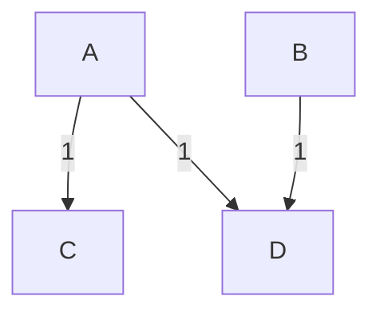

<!--toc:start-->
- [Payback](#payback)
- [How it works](#how-it-works)
  - [Generating Graphs](#generating-graphs)
    - [Via Weighted Directed Edges](#via-weighted-directed-edges)
      - [From Vec<((String, String), i64)>](#from-vecstring-string-i64)
      - [From HashMap<(String, String), i64>](#from-hashmapstring-string-i64)
    - [Via Vertex Weights](#via-vertex-weights)
      - [From Vec<i64>](#from-veci64)
      - [From Vec<(String, i64)>](#from-vecstring-i64)
      - [From HashMap<String, i64>](#from-hashmapstring-i64)
  - [Solving](#solving)
    - [ProblemInstancesApproxmiation](#probleminstancesapproxmiation)
      - [Star Expand](#star-expand)
      - [Greedy Satisfaction](#greedy-satisfaction)
    - [ProblemInstancePartition](#probleminstancepartition)
- [Note](#note)
<!--toc:end-->

# Payback

If you have a network of people, which own each other money, paying off debts can lead to many transactions. With this crate the amount of transactions can be minimized.

# How it works
We represent the network as a graph. Each node represents one person and every person has an amount of money the need to pay/receive represented as a vertex weight. Negative weights indicate a net dept to the network while positive weights indicate a dept on the side of the network to the person.
The aim is to find directed weighted edges, which indicate cash flow, such that for every person there inflow minus there outflow is equal to their vertex weight (how much money they own/get from the network). Also, the amount of edges should be minimal.

## Generating Graphs
A graph can be generated in two different manners.

### Via Weighted Directed Edges
In this method we describe the edges between the nodes. Each edge has a start and end node with a weight. Every vertex needs a unique name. Otherwise, the two vertices will be interpreted as the same.
We show how to create the following graph.

The graph from this representation will just be converted to a graph from #via-vertex-weights.

#### From Vec<((String, String), i64)>
```rust
let input: Vec<((String, String), i64)> = vec![
    (("A".to_string(), "C".to_string()), 1),
    (("A".to_string(), "D".to_string()), 1),
    (("B".to_string(), "D".to_string()), 1),
];
let graph: Graph = input.into();
```
Here the nodes are named `A`, `B`, `C`, `D`.

#### From HashMap<(String, String), i64>
```rust
let mut input: HashMap<(String, String), i64> = HashMap::new();
input.insert(("A".to_string(), "C".to_string()), 1);
input.insert(("A".to_string(), "D".to_string()), 1);
input.insert(("B".to_string(), "D".to_string()), 1);
let graph: Graph = input.into();
```
Here the nodes are named `A`, `B`, `C`, `D`.

### Via Vertex Weights
For this method, we will tell the graph the nodes and there weight directly. Here are some options for this option.
We show how to create the following nodes and their weights.
| Vertex | A | B | C | D |
| --- | --- | --- | ---| ---|
| Weight | -2 | -1 | 1 | 2 |

#### From Vec<i64>
```rust
let input: Vec<i64> = vec![-2, -1, 1, 2];
let graph: Graph = input.into();
```
Here the nodes names are just numbers from `0` to `n`. Therefore, `0`, `1`, `2`, `3`.

#### From Vec<(String, i64)>
```rust
let input: Vec<(String, i64)> = vec![
    ("A".to_string(), -2),
    ("B".to_string(), -1),
    ("C".to_string(), 1),
    ("D".to_string(), 2),
];
let graph: Graph = input.into();
```
Here the nodes are named `A`, `B`, `C`, `D`.

#### From HashMap<String, i64>
```rust
let mut input: HashMap<String, i64> = HashMap::new();
input.insert("A".to_string(), -2);
input.insert("B".to_string(), -1);
input.insert("C".to_string(), 1);
input.insert("D".to_string(), 2);
let graph: Graph = input.into();
```
Here the nodes are named `A`, `B`, `C`, `D`.

## Solving
Now that we have described the problem instance with a graph we can solve it. For that purpose we create a `ProblemInastance`, which describes who the instance will be solved.
| Available ProblemInstances with solver | Description |
| --- | --- |
| ProblemInstancePartition | Generates all partitionings of the vertex set and, for each partition of a partitioning, merges the solutions obtained by an approximation algorithm of the partitions. Then the solution of the largest partitioning is returned. This is an exact answer. |
| ProblemInstanceApproximation | TO BE IMPLEMENTED. |

### ProblemInstancesApproxmiation
**TO BE IMPLEMENTED**
We have two approximation algorithms, which have at most double the amount of edges of an optimal solution.

#### Star Expand
This approximation algorithm focuses the load of solving the instance on one node. This helps the mitigate untrustworthy person by not routing additional money through them. 
This can lead to a suboptimal amount of total money moved.

#### Greedy Satisfaction
This approximation algorithm only uses the minimal required amount of total money moved.

### ProblemInstancePartition
We can create a problem instance from a graph (see #generating-graphs).
```rust
let graph: Graph = ...;
let instance: ProblemInstancePartition = ProblemInstancePartition::from(graph).solve();
```

This algorithm gives an exact solution for the instance and uses one of the approximation algorithms. Depending on which approximation algorithm is chosen the solution can vary.
For #star-expand:
```rust
instance.solve_and_interpret_with(partition::PartitionSolvingMethod::StarExpand);
// "C" to "B": 1.0
// "D" to "A": 2.0
```
And for #greedy-satisfaction:
```rust
instance.solve_and_interpret_with(partition::PartitionSolvingMethod::StarExpand);
// "D" to "A": 2.0
// "C" to "B": 1.0
```

# Note
This problem is NP-Hard and therefore can have a long runtime for bigger instances.
